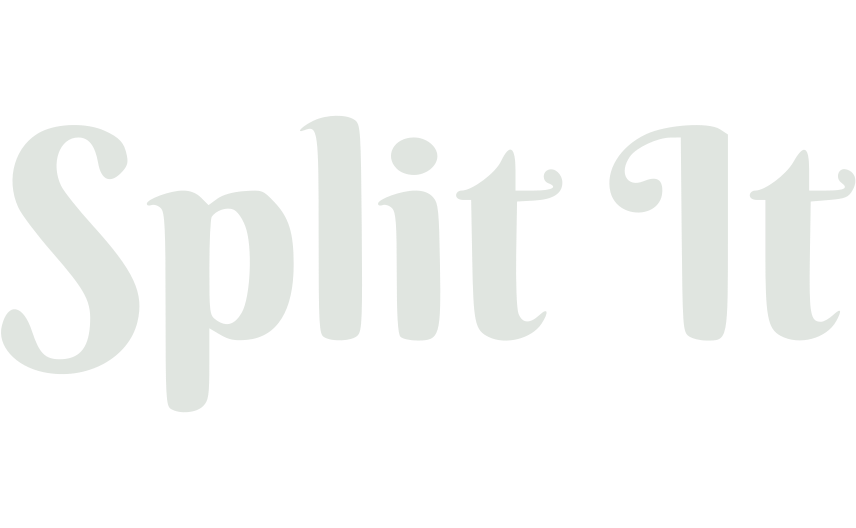
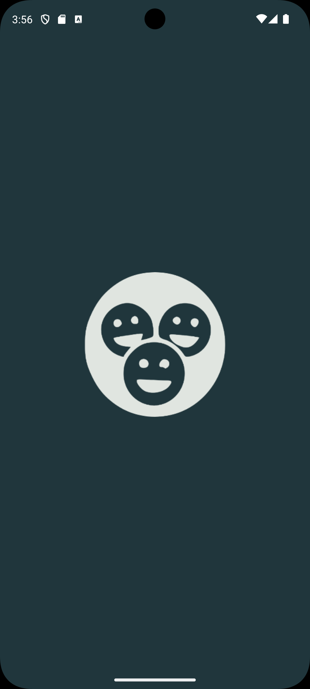
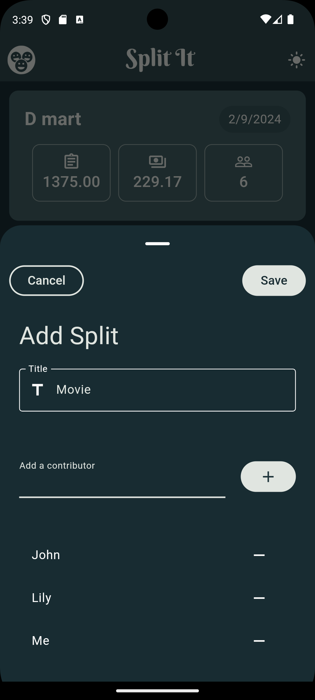
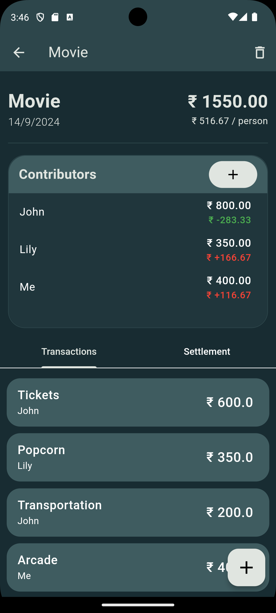
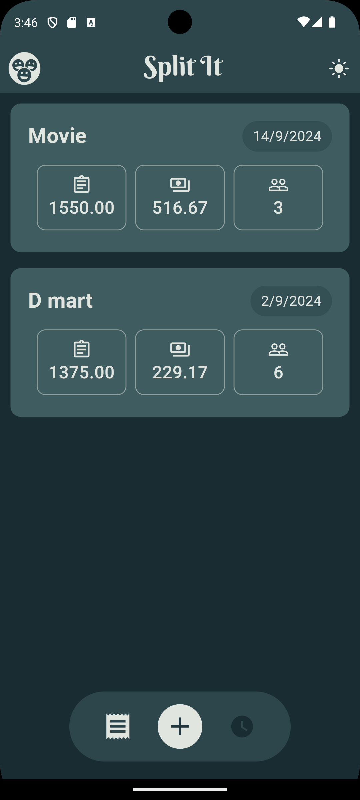
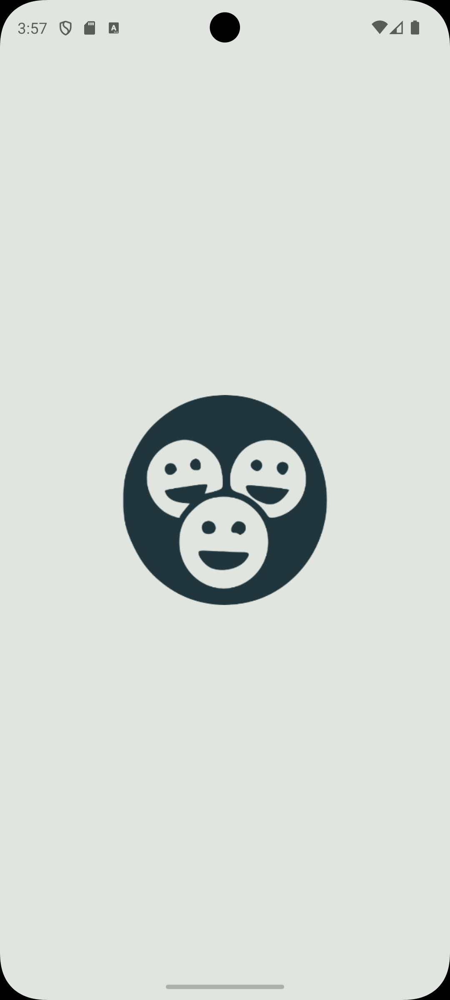
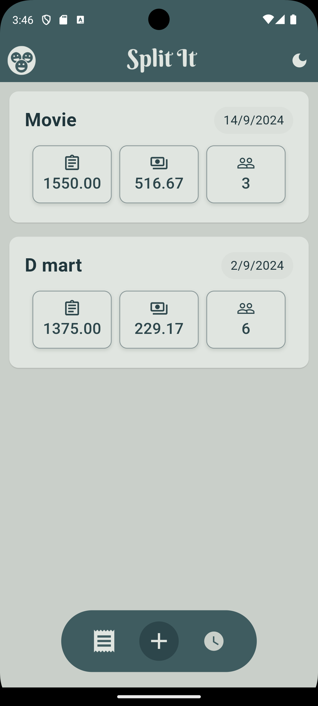
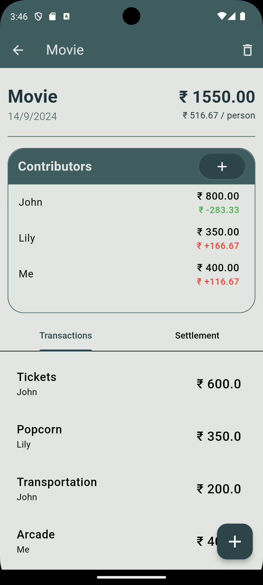
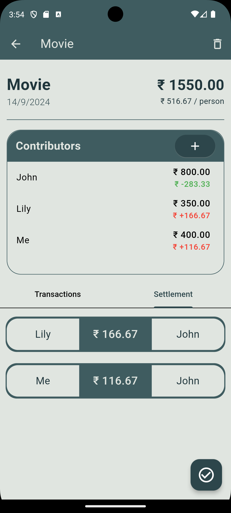

# Split It




## Table of Contents

1. [Introduction](#introduction)
2. [Features](#features)
3. [Tech Stack](#tech-stack)
4. [Installation](#installation)
5. [Screenshots](#screenshots)
6. [Contributing](#contributing)
7. [License](#license)

## Introduction

**Split It** is a simple offline app designed to help groups split bills and track payments efficiently. Whether you're out for dinner with friends or sharing expenses on a trip, Split It helps keep track of who paid, how much, and what for, making settling up at the end straightforward.

## Features

- Create and manage **Splits** for different groups or events.
- Add **Contributors** to each split.
- Record **Transactions**, including details like who paid, the amount, and the purpose of the payment.
- Generate **Settlement Suggestions** to equalize the bill at the end, showing exactly how much each person owes or is owed.
- Offline support using the **Isar database**, no account or authentication required.

## Tech Stack

Technologies Used

- Flutter
- Isar Database for storage
- Riverpod for state management

## Installation

1. Clone the repository
   
   ```bash
      git clone https://www.github.com/daveydark/split-it.git
   ```

2. Navigate to the Project Directory
   
   ```bash
   cd split-it
   ```

3. Install dependencies
   
   ```bash
   flutter pub get
   ```

4. Run the app
   Make sure you have an Android/iOS device with usb debugging or an iOS/Android emulator set up
   
   ```bash
   flutter run
   ```

## Screenshots

<div>




</div>
<div>



 
</div>

## Contributing

Contributions are welcome! If you find any bugs or want to contribute new features, feel free to open an issue or submit a pull request.

## License

This project is licensed under the MIT License. See the LICENSE file for more details.
